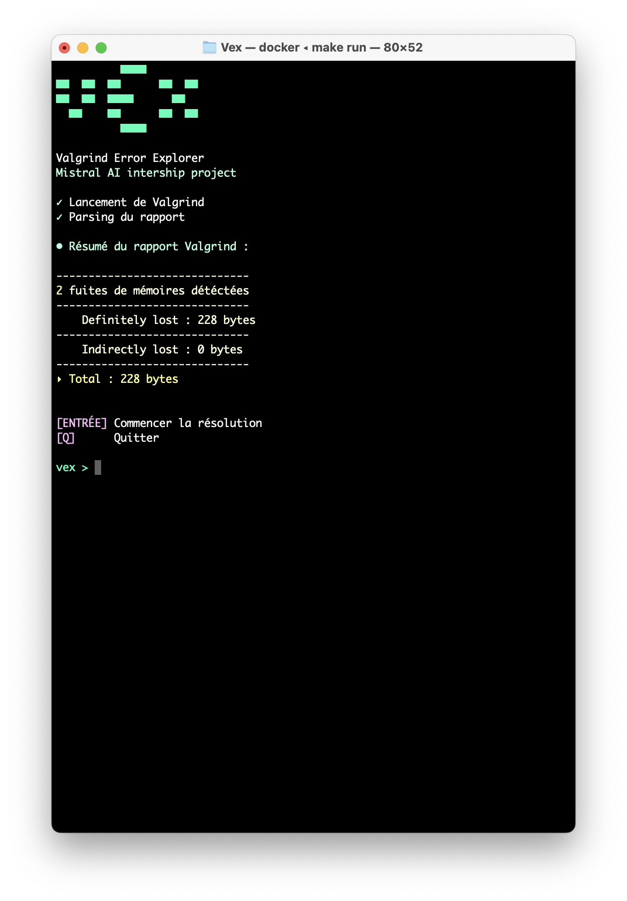
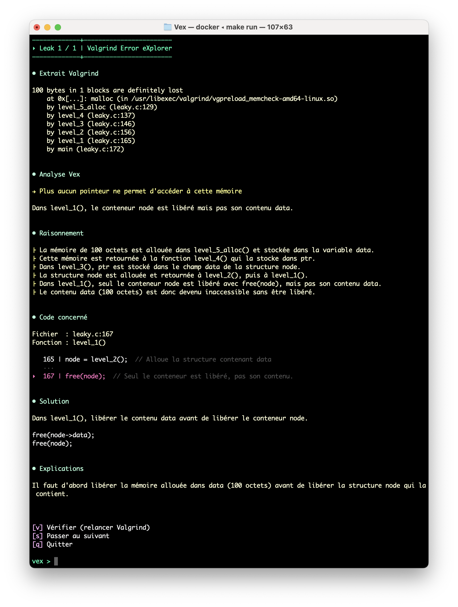

<pre>
          ████
██  ██  ██      ██  ██
██  ██  ████      ██
  ██    ██      ██  ██
          ████
</pre>

# Vex - Valgrind Error eXplorer

TO DO :  
Dec 25 : Améliorer ergonomie relance valgrind après correciton leak. 
         Améliorer ergonomie lancement : vex ./mon_prog

## Vex ?

Etudiant à 42 j'ai passé des heures à déchiffrer les rapports Valgrind en arrivant à ce constat :

Pourquoi perdre du temps à comprendre les traces cryptiques quand une IA pourrait expliquer le problème en langage clair ?

**Vex** analyse vos memory leaks et vous dit exactement :

- Quelle ligne de code pose problème
- Pourquoi cette ligne crée un leak
- Comment le corriger concrètement
    
## Fonctionnalités

- Analyse automatique : Lance Valgrind, parse le rapport, extrait le contexte du code
- Explications IA : Utilise Mistral AI pour fournir des diagnostics pédagogiques
- Interface soignée : Affichage terminal propre avec formatage ANSI
- Workflow interactif : Analyse un leak à la fois pour corriger progressivement
- Catégorisation intelligente : Identifie 3 types de leaks (mémoire jamais free, pointeur perdu, mémoire inaccessible)
- Focus "definitely lost" : Se concentre sur les fuites mémoire critiques (v1.0)

## À qui s'adresse VEX ?

**Vex** est conçu pour tous ceux qui apprennent ou utilisent le C. L'objectif n'est pas de masquer les erreurs mais d'apprendre en comprenant.
Chaque analyse explique :

- Le concept mémoire sous-jacent
- L'erreur concrète dans votre code
- La solution recommandée

**Vex** est un outil d'apprentissage qui aide les développeurs à maîtriser la gestion mémoire en C.
