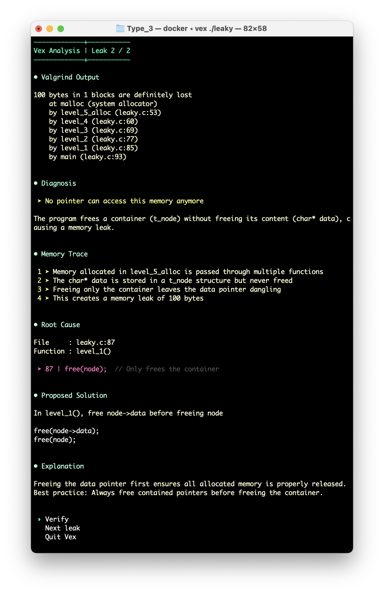

<p align="center">
  
</p>

<h3 align="center">Deterministic memory leak analysis, explained by AI.</h3>

---

## What is VEX?

VEX (Valgrind Error eXplorer) is a CLI tool that analyzes memory leaks in C programs. It combines Valgrind, GDB dynamic tracing, and Mistral AI to identify the root cause of each leak and explain how to fix it.

## Why VEX?

Memory leak analysis is a domain where LLMs perform poorly when used alone. They don't simulate memory, propagate early mistakes, and often fail on non-trivial cases involving aliasing, embedded allocations, or container lifetimes.

**VEX takes a different approach** — it separates the problem into two phases:

1. **Deterministic root cause identification** — Valgrind detects the leak, GDB traces execution dynamically, and a Python algorithm tracks memory ownership line by line
2. **LLM-assisted explanation** — Mistral AI explains the leak, justifies the root cause, and suggests a minimal fix

The LLM never guesses ownership or simulates memory. It only explains what the deterministic analysis has already proven.

## Installation

### Linux (native)

**Requirements:** `valgrind`, `gdb`, `python3`, `pip3`

```bash
git clone <repository-url>
cd vex
make install
```

Installs to `~/.local/` — no sudo required. Missing dependencies are detected automatically.

### macOS (Docker)

**Requirements:** Docker

```bash
git clone git@github.com:hooop/Vex.git
cd vex
make install
```

Builds a Docker image and installs the `vex` command to `/usr/local/bin` (requires sudo).

### Configure your API key

```bash
vex configure
```

Enter your [Mistral AI](https://console.mistral.ai/) API key when prompted.

> For the best visual experience, use a terminal with a dark background.

## Usage

```bash
vex <executable> [arguments]
```

### Example

```bash
cd examples/test_array
make
vex ./leaky
```

The `examples/` directory contains scenarios for each leak type.


## How It Works

```
Source + Executable
        |
        v
   1. Valgrind         →  Detects leaks, reports allocation/free sites
        |
        v
   2. GDB Tracing      →  Dynamic execution trace with loop, branch,
        |                  and cross-function tracking
        v
   3. Memory Tracker    →  Tracks roots, access paths, ownership transfers
        |                  Identifies the exact line where the leak occurs
        v
   4. Mistral AI        →  Explains the root cause and suggests a fix
```

**GDB dynamic tracing** follows the actual execution path of your program — through loops, conditionals, and function calls — to build a precise trace that the memory tracker uses to reason about ownership.

## Leak Classification

VEX categorizes leaks into three types:

| Type | Name | Description |
|------|------|-------------|
| 1 | **Missing free** | Allocation never freed before all paths disappear |
| 2 | **Path loss by reassignment** | Last access path overwritten or set to NULL |
| 3 | **Container freed first** | Structure freed while still owning embedded allocations |

Each points to the precise line of code responsible.

## Limitations

- One allocation tracked at a time
- Single execution path (no multi-threading analysis)

## Design Philosophy

- **Deterministic analysis** handles root cause identification — zero false positives within supported scope
- **LLMs** handle explanation, pedagogy, and fix suggestions

The goal isn't to replace Valgrind, but to make its output actionable for developers learning C.
