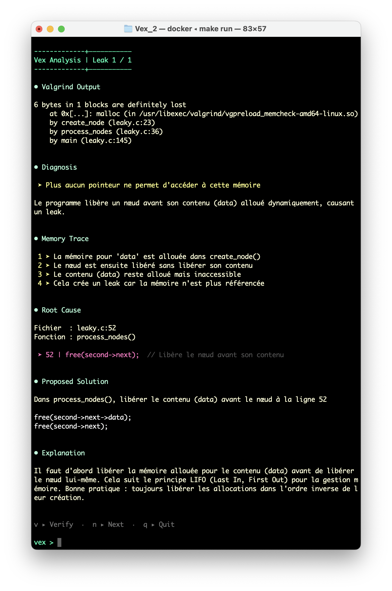

# Memory Leak Analysis with Deterministic Path Tracking

## Context

Memory leak analysis in C is a domain where Large Language Models (LLMs) perform poorly when used naively.  
LLMs do not simulate memory: they describe graphs textually, propagate early mistakes, and often fail on non-trivial cases involving:

- aliasing,
- embedded allocations,
- container lifetimes,
- order-dependent frees.

This project explores a different approach.

---

<video src="https://github.com/user-attachments/assets/806e0a9e-c8f1-4f40-93ef-b8e60c12cb1c" width="100%" controls></video>

## Core Idea

Instead of asking a language model to find the root cause of a memory leak, this project separates the problem into two distinct phases:

1. **Deterministic root cause identification**  
2. **LLM-assisted explanation and fix suggestion**

The LLM is never responsible for discovering the leak.

---

## Deterministic Memory Path Tracking

Given:

- a Valgrind report pointing to a specific allocation,
- the corresponding call stack,
- the source code of the involved functions,

the tool tracks **only one allocation at a time**, following its access paths through the code in execution order.  

The algorithm maintains a structure describing:

- which variables can still reach the allocation,
- through which access paths,
- and how these paths disappear over time.

The analysis proceeds **line by line**, strictly following the execution trace implied by Valgrind.

- No global reasoning  
- No speculative cleanup functions  
- No attempt to “understand the whole program”

---

## Tracking Model

Each reachable access path is represented by a **root**:

- A root is a variable through which the allocation can be reached.  
- Each root tracks:  
  - the full access path (e.g. `node->data`)  
  - all intermediate segments (`node`, `node->data`)  
  - an optional origin, used to resolve aliases  

The algorithm updates this structure when encountering:

- alias creation  
- reassignment  
- `free()` calls  
- scope exits  
- returns across the call stack  

When no valid access path remains and the allocation was not freed, a **root cause** is identified.

---

## Leak Categories

The algorithm classifies leaks into **three concrete types**:

1. **Missing free**  
   The allocation is never freed before all access paths disappear.

2. **Path loss by reassignment**  
   The last remaining access path is overwritten or set to `NULL`.

3. **Container freed before embedded data**  
   A structure is freed while still owning embedded allocations.

Each category points to a precise line of code responsible for the leak.

---

## Role of the LLM

The LLM is used **after the deterministic phase**.  

Input to the model:

- Valgrind report  
- Relevant source code  
- Identified root cause  
- Classified leak type  

The model is asked to:

- explain the leak step by step  
- justify why the root cause is correct  
- propose a minimal and correct fix  
- explain relevant best practices to avoid recurrence

The LLM **never guesses ownership or simulates memory**.

---

## Design Philosophy

This project intentionally avoids:

- global program analysis  
- heuristics  
- “smart” guessing  
- overfitting to simple examples  

Instead, it focuses on:

- constrained reasoning  
- explicit assumptions  
- failure modes that are easy to detect and explain  
- developer trust  

When the algorithm cannot conclude, it fails explicitly.

---

## Limitations

- No loop handling (by design)  
- Single execution path only  
- One allocation tracked at a time  
- Relies on Valgrind’s accuracy  

These limitations are accepted trade-offs to guarantee correctness within the supported scope.

---

## Why This Matters

This project explores how deterministic analysis and language models can **complement each other**, by assigning each tool a role aligned with its actual strengths:

- Deterministic analysis handles root cause identification with **zero false positives**
- LLMs are constrained to tasks they excel at: explanation, pedagogy, and fix suggestions
- The combination produces results that are **more trustworthy** than end-to-end LLM solutions

The goal is not to replace Valgrind, but to make its output **actionable** for developers learning C.

---

## Status

- The deterministic analysis is functional and has been tested on **non-trivial aliasing and container lifetime scenarios**.  
- The LLM integration focuses on **explanation quality and fix correctness**, not detection.
